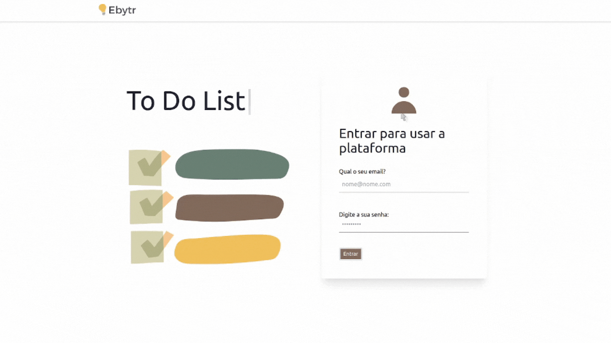
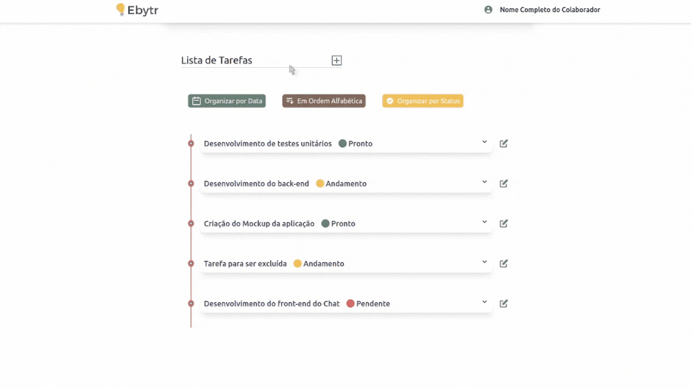
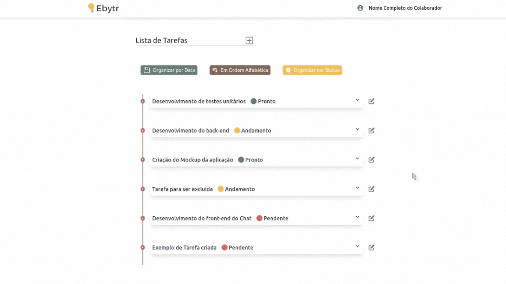
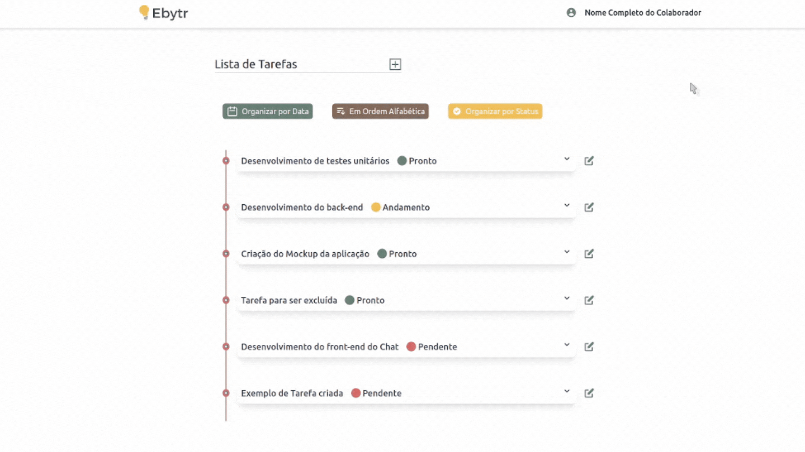
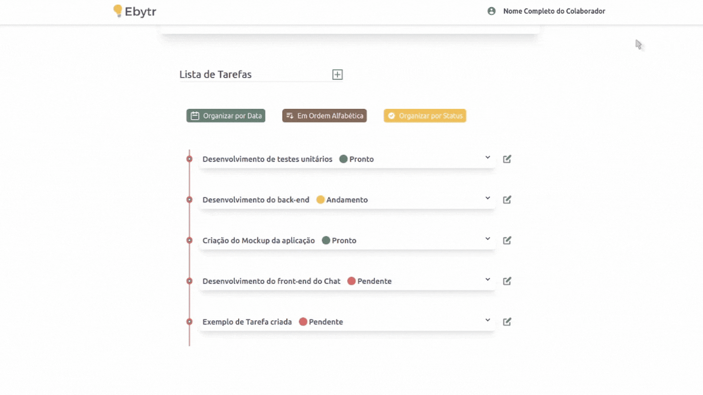
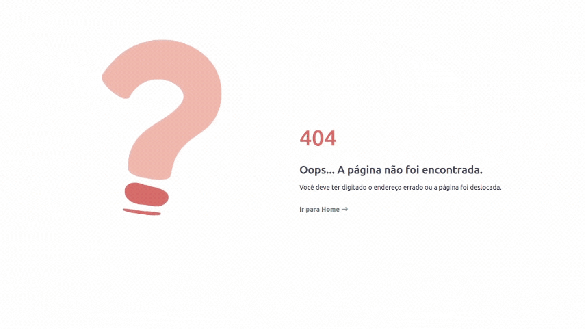
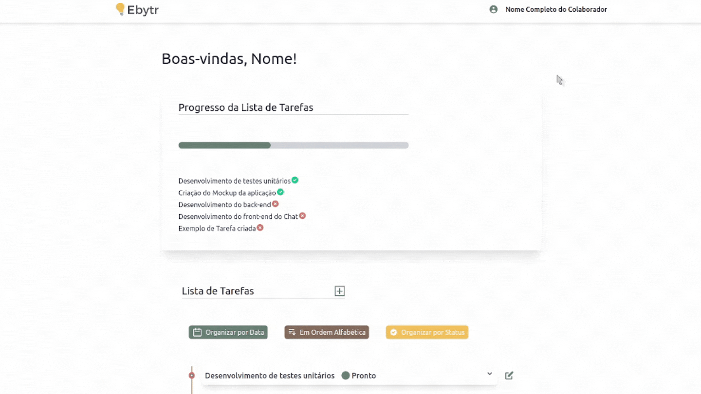

# Desafio Ebytr - To Do List

## Boas vindas ao repositório do Desafio Técnico - Caso da empresa Ebytr

Esse desafio foi proposto pela [Trybe](https://www.betrybe.com/), em que requisita habilidades e ferramentas necessáiras para desenvolver um projeto **Full Stack**. O resultado final é uma plataforma para **organização e acompanhamento das tarefas** pelos colaboradores, salvando dados num banco de dados **NoSQL** através de uma **API RESTFull**.

---

## Sumário

- [Contexto do *Case*](#contexto-do-case)
  - [Requisitos técnicos](#requisitos-técnicos)
  - [Funcionalidades](#funcionalidades)
- [Entregáveis](#entregáveis)
- [Usando a plataforma](#usando-a-plataforma)
  - [Primeiro Acesso](#primeiro-acesso)
  - [Criando uma tarefa](#criando-uma-tarefa)
  - [Atualizando uma tarefa](#atualizando-uma-tarefa)
  - [Excluindo uma tarefa](#excluindo-uma-tarefa)
  - [Ordenando a Lista de Tarefas](#ordenando-a-lista-de-tarefas)
  - [Digitando a URL de forma errada](#digitando-a-url-de-forma-errada)
  - [Realizando o *Logout*](#realizando-o-logout)
- [Link para o deploy da Plataforma](#link-para-o-deploy-da-plataforma)
---

## Contexto do *Case*

*"A empresa **Ebytr** está passando por problemas de produtividade/controle porque as pessoas colaboradoras vêm tendo dificuldade na organização de suas tarefas individuais. Por esse motivo, a diretora de produto Carolina Bigonha decidiu implantar **uma nova forma de organizar as tarefas.**"*

*"Você foi a pessoa contratada para desenvolver um sistema capaz de **auxiliar as pessoas colaboradoras a se organizar e ter mais produtividade**.
Na Ebytr o time de desenvolvimento utiliza a **Stack MERN** para criar suas aplicações. Foi combinado com a Ebytr que você utilizará essa mesma Stack para resolver o problema de organização e produtividade da empresa."*

Abaixo estão os requisitos técnicos e as funcionalidades que a solução deve possuir:

### Requisitos técnicos

- [x] Front-End em React;
- [x] Back-End em NodeJS, com MongoDB;
- [x] Arquitetura em camadas;

### Funcionalidades

- [x] Visualizar a lista de tarefas;
- [x] Esta lista deve ser ordenável por ordem alfabética, data de criação ou por status;
- [x] Inserir uma nova tarefa na lista;
- [x] Remover uma tarefa da lista;
- [x] Atualizar uma tarefa da lista;
- [x] A tarefa deve possuir um status editável: pendente, em andamento ou pronto;

## Entregáveis

Para entregar a solução desafio foi necessário separar as duas partes de front-end e back-end em **cada um destes** repositórios:

- [Repositório com o backend](https://github.com/dudawiltiner/desafio-backend-ebytr).

- [Repositório com o frontend](https://github.com/dudawiltiner/desafio-frontend-ebytr);

---

## Usando a plataforma

Após cada um dos passos a seguir, haverá um exemplo de como cada componente pode ser usado, caso tenha dificuldades e o exemplo não seja suficiente, não hesite em me contatar em _eduardawiltiner@gmail.com_.

### Primeiro Acesso

Acessando a plataforma neste [link](https://desafioebytr.vercel.app/) , você irá encontrar a tela de **Login**, em que para ter acesso ao acompanhamento das tarefas, você deverá se autenticar. Sem a autenticação você não terá acesso a Home, mas quando autenticado você não terá que fazer o login novamente quando fechar a página e abri-la novamente.

  

### Criando uma tarefa

Para criar uma tarefa, você deve apenas clicar no "+" a direita do título "To Do List". Uma data de prazo já estará configurada para o mesmo dia de criação da tarefa, mas você pode modificá-la.

  

### Atualizando uma tarefa

Para atualizar uma tarefa, você deve apenas clicar no símbolo de edição à direita de cada tarefa. E você pode perceber que a mudança de status vai interferir na barra de progresso.

  

  
### Excluindo uma tarefa

Para excluir uma tarefa, você deve apenas clicar no símbolo de edição à direita de cada tarefa e logo depois clicar no botão "Remover". E você pode perceber que a mudança de status vai interferir na barra de progresso.

  

### Ordenando a Lista de Tarefas

Você pode ordenar a lista de forma alfabética, pelo status e por data de criação clicando nos botões correspondentes.

  

### Digitando a URL de forma errada

Ao digitar a URL do site de forma errada, não se preocupe, vai paracer a página de erro 404 que vai te ajudar a voltar a **Home**.

  

  
### Realizando o *Logout*

Para se desconectar da sua conta, só é necessário clicar em seu nome no NavBar e em seguida em "Sair".

  

## Link para o deploy da Plataforma:
https://desafioebytr.vercel.app/

OBS:Lembrando que para acessar a plataforma deve possuir um cadastro no banco de dados.
